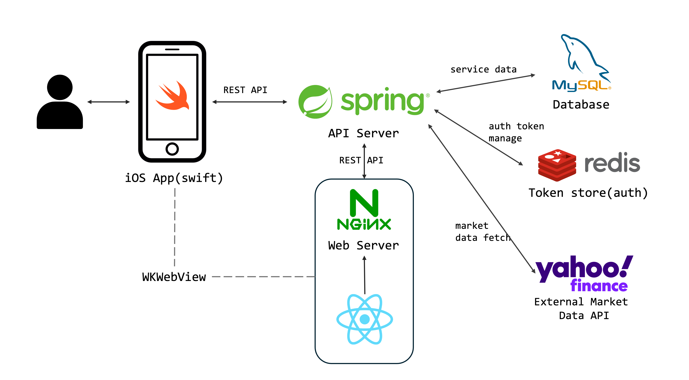
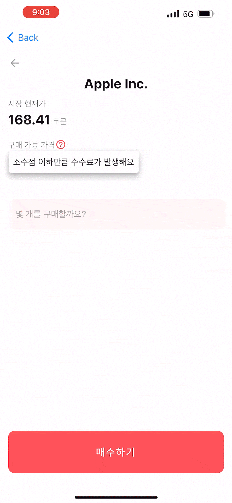
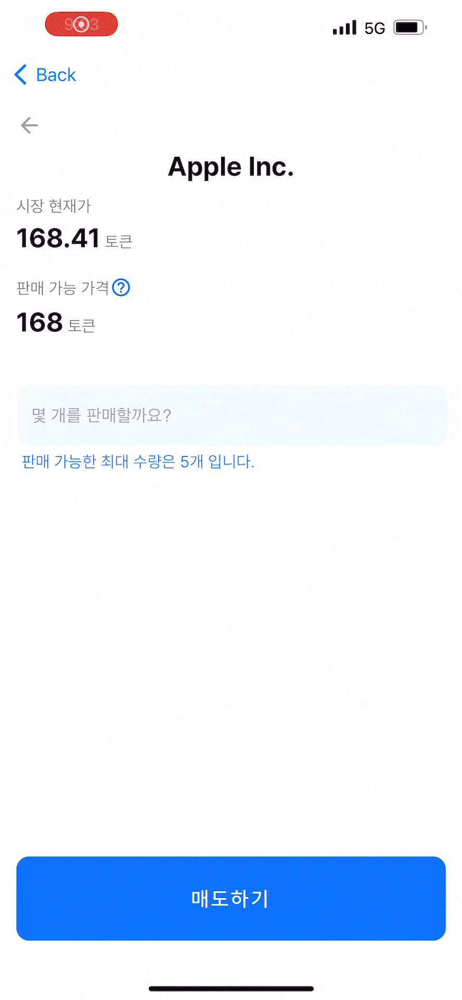
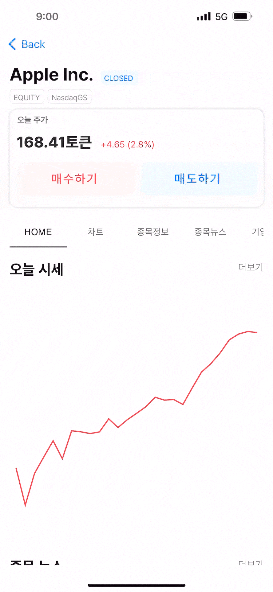
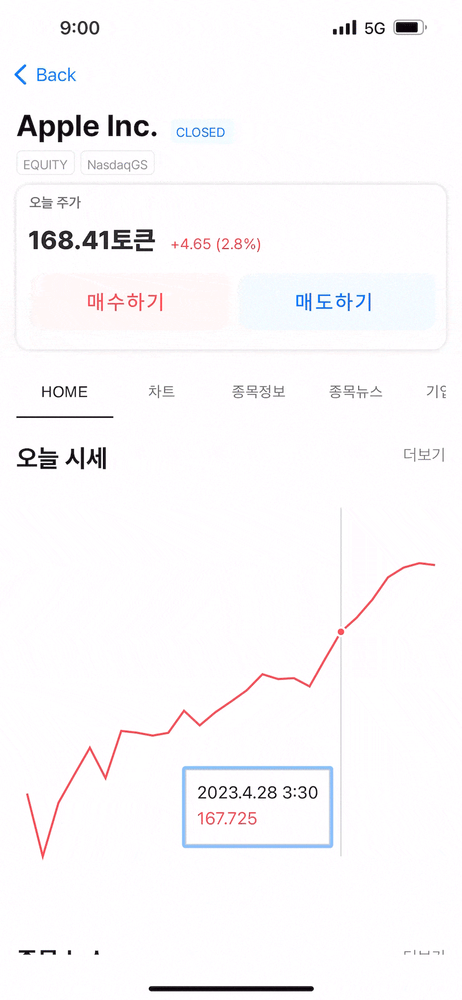

# M-Class React WebView 
This page belongs to the Frontend (WebView) repository of the M-CLASS project. <br/>
You can find the other project repositories below: <br/>
[M-Class Backend](https://github.com/Miraeasset-MobileInternship/backend) : Backend of M-Class with SpringBoot <br/>

<br/><br/>

## Overview

M-Class is a full-stack fintech education app designed to help teenagers experience simulated banking and stock investment in a classroom environment.
The app digitises a classroom-based economic education model where students use class currency, manage assets, and learn basic financial concepts through practical activities.

<br/><br/>

## Background & Problem
In some classroom-based financial education programs, students use class currency and assigned roles to learn economic activities. However, these activities are often managed manually, which makes it difficult to track assets, transactions, and investment learning progress.
This project aimed to digitise the process and provide students with a more interactive way to learn banking and stock investment concepts.
<br/><br/>


## Overall Project Tech Stack

| Area | Tech | My Responsibility |
|---|---|---|
| Mobile App |   | Collaborated / not my main responsibility |
| Frontend WebView |   | Implemented core stock screens |
| Backend |  | Implemented full backend |
| Database |  | Designed and implemented schema |
| Cache / Token Management |  | Implemented token management |
| External API |  | Integrated stock data |
| UI / Design |  | Participated in planning/design |
> Note: The iOS native wrapper was implemented by another team member. I was responsible for the React WebView screens and the Spring Boot backend.

<br/><br/>

## WebView Frontend Tech Stack


<br/><br/>

## Architecture


The app used an iOS native wrapper with React-based WebView screens for stock-related flows.
The React WebView communicated with the Spring Boot backend through REST APIs. The backend handled authentication, student data, banking features, simulated trading flows, and stock information. MySQL was used for relational data, Redis was used for token management, and Yahoo Finance API was used for stock-related data.

<br/><br/>

## Web Frontend Features

### Stock Detail Page
- Displayed current stock information
- Rendered stock chart data
- Showed related stocks
- Displayed stock news and company information
- Provided ranking sections such as today's stocks
- Connected stock detail data with backend APIs

### Buy Screen
- Displayed selected stock information
- Supported quantity and price-related input flow
- Calculated simulated order amount
- Connected the buy flow with backend APIs

### Sell Screen
- Displayed user-owned stock information
- Supported sell quantity input flow
- Connected the sell flow with backend APIs

### Mobile WebView Layout
- Implemented layouts designed for an iOS WebView environment
- Adjusted UI components for mobile screen constraints

<br/><br/>

## Demo

### Buy & Sell

<p align="center">
  
  
</p>

### Stock Detail View

<p align="center">
  
</p>

### Chart View

<p align="center">
  
</p>

### News View

<p align="center">
  
</p>

<br/><br/>

## Project status

This repository focuses on the React WebView part of the original M-Class project.
The original project was built as an internship project and was not publicly deployed. The iOS native wrapper is not included in this repository. Some backend API and database setup may be required to run the full flow locally.
For portfolio purposes, this README focuses on the WebView screens I implemented, their user flows, and how they connected with the backend APIs.


<br/><br/>

## How to Run

### 1. Clone the repository

```bash
git clone
cd frontend-webview
```

### 2. Clone the repository

```bash
npm install
```

### 3. Start the development server

```bash
npm start
```

### 4. The app will run at http://localhost:3000
> Note: All screens require the Spring Boot backend and yahoo finance API to display full functionality.
